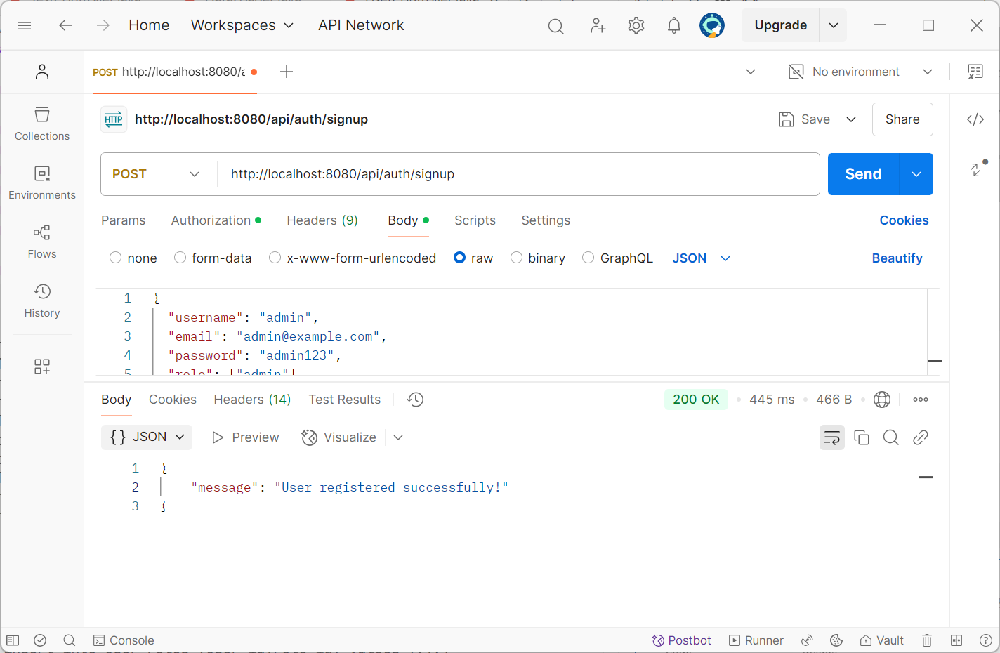
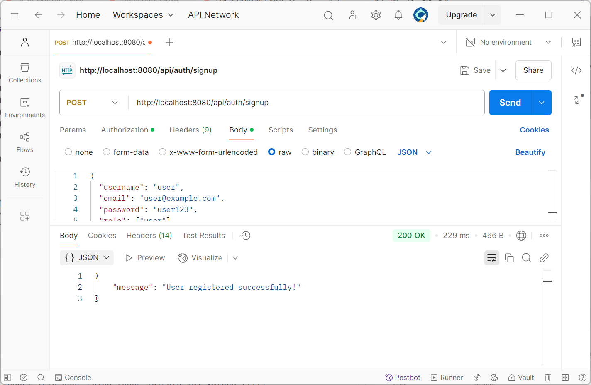
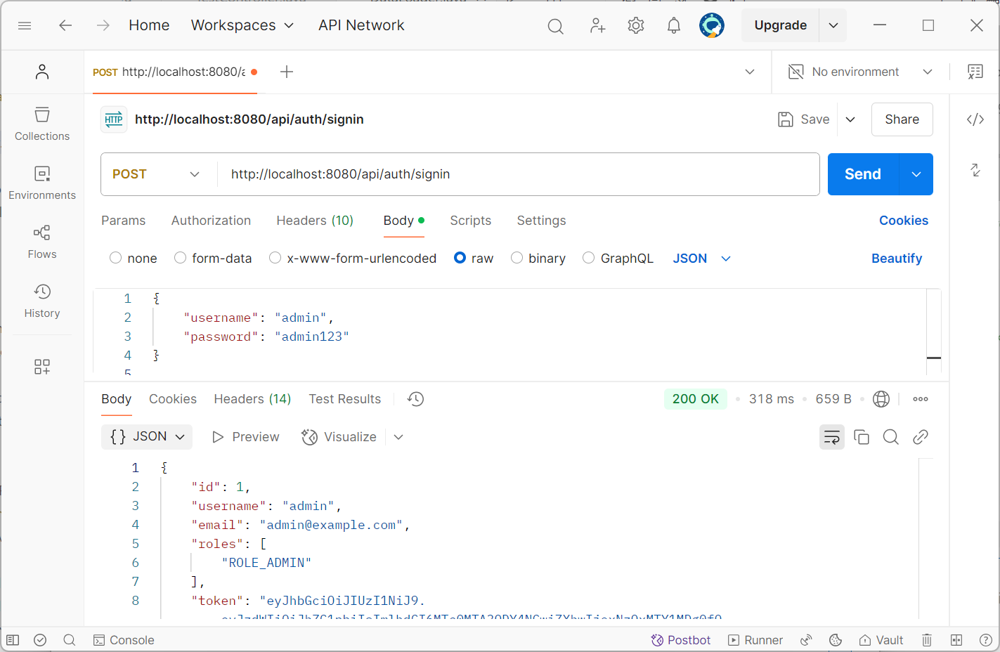
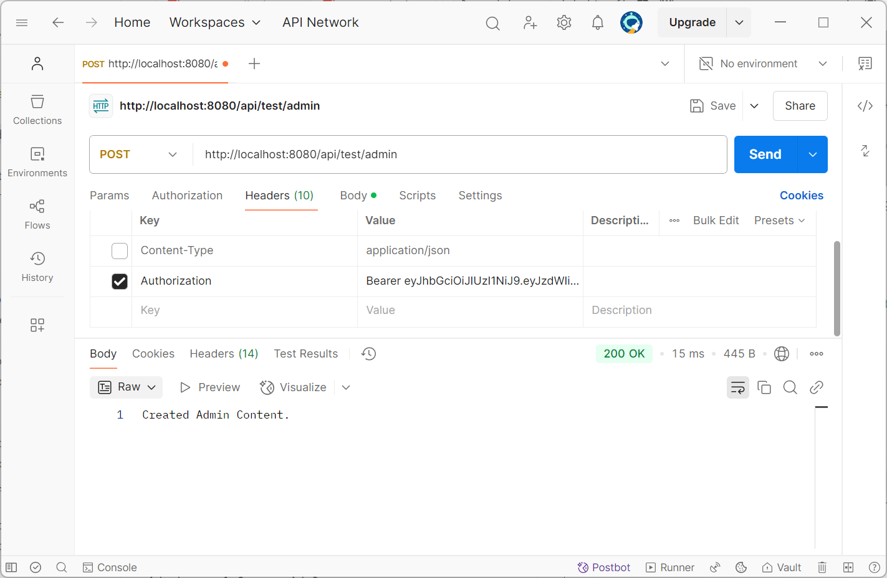
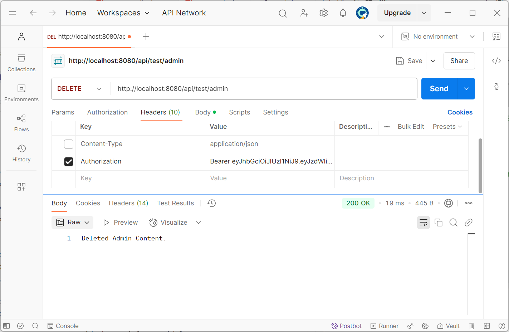
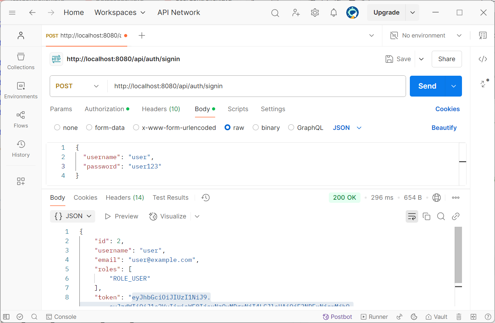
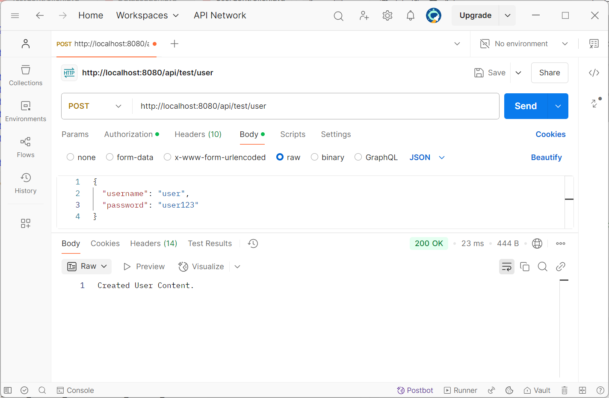
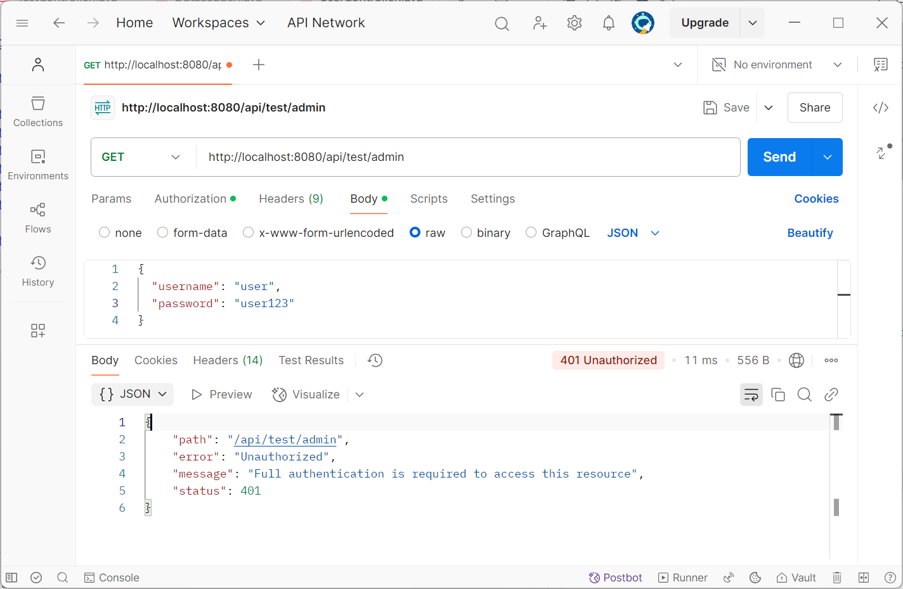
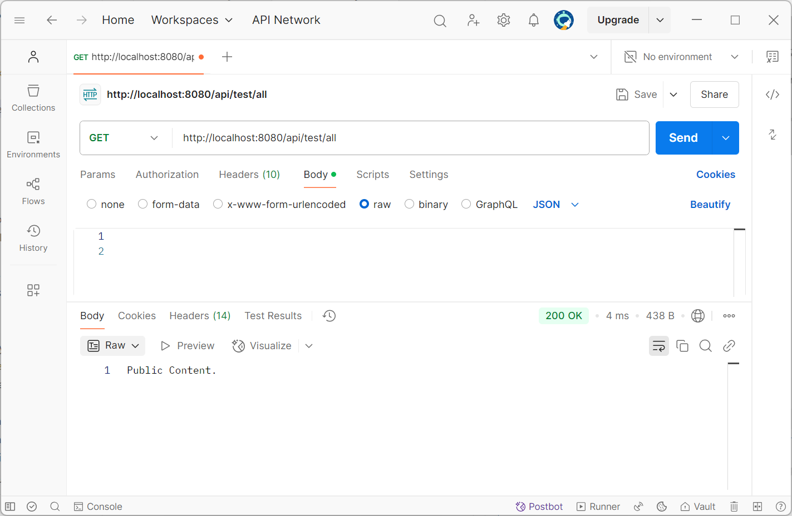

# JWT RestAPI

Name: Trần Vỹ Anh
StudentID: 22024508

## Overview
This project is a REST API implementation using Spring Boot and Spring Security with JWT (JSON Web Token) authentication. It demonstrates secure authentication and authorization mechanisms, allowing different levels of access control for users and administrators.

## Key Features
- JWT-based authentication and authorization
- Role-based access control (User and Admin roles)
- Secure endpoints with Spring Security
- RESTful API endpoints:
  - Public access endpoints
  - User-restricted endpoints
  - Admin-restricted endpoints
- User management:
  - User registration (signup)
  - User authentication (signin)
  - Token-based session management
- Database persistence with JPA/Hibernate
- Password encryption with BCrypt
- Cross-Origin Resource Sharing (CORS) support
- Comprehensive API testing examples

## Installation Guide
1. Build the project using Maven:
    ```sh
    mvn clean install
    ```

2. Run the application:
    ```sh
    mvn spring-boot:run
    ```

## Test API
### Register new user
Admin

User


### Admin 
Sign in and get JWT token

GET

POST

PUT

DELETE


### User
Sign in

GET

POST

Access declined when GET from admin


### Public
GET

